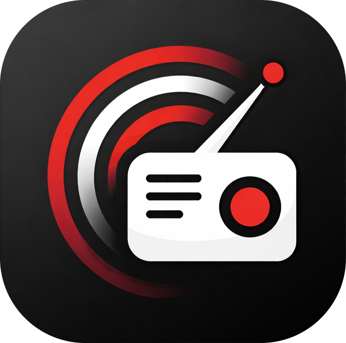
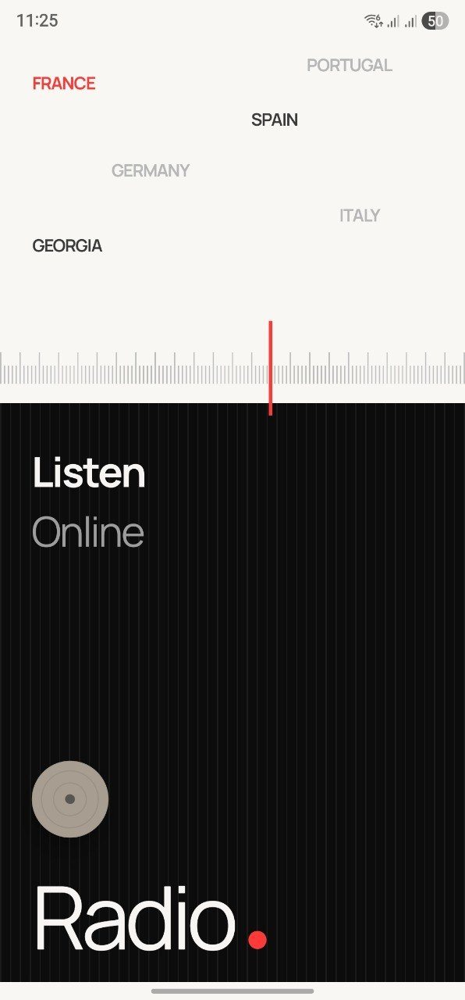
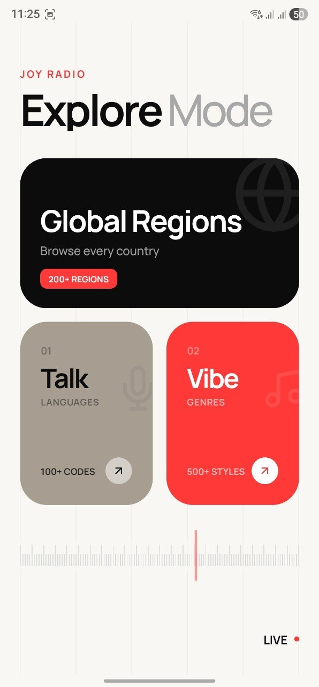
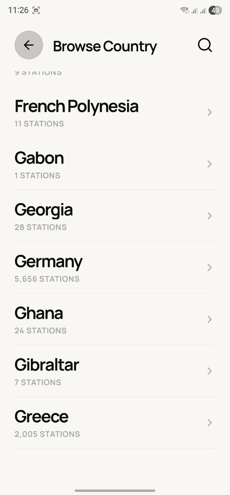
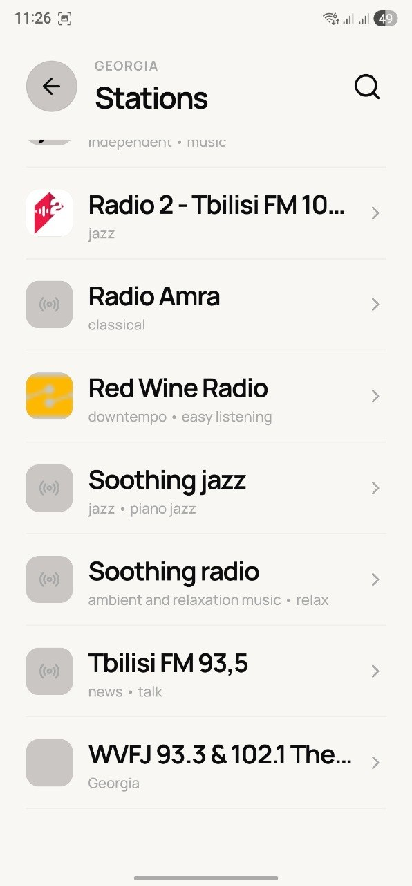
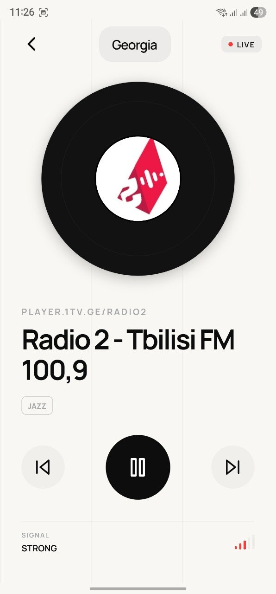

# Joy Radio

<p align="center">
  
</p>

Joy Radio is a design-forward, open-source online radio app built with Expo and React Native. The visual direction for this project was inspired by **Tamarashvili** and the Dribbble shot [UI Exploration. Online Radio](https://dribbble.com/shots/24479926-UI-Exploration-Online-Radio). It combines a minimal editorial-style interface with live station discovery, country browsing, and a high-performance in-app player experience.

## Highlights

- **Design-Centric UI**: Minimal, high-contrast, and editorial-inspired interface.
- **Global Discovery**: Powered by the Radio Browser directory.
- **Smart Connection**: Auto-timeout and signal status feedback for dead links.
- **High-Performance**: List virtualization for scrolling through thousands of stations without lag.
- **Modern Architecture**: Built with the latest Expo Audio and Reanimated APIs.
- **Shared Context**: Global player state management and mini-player support.

## Interface

<p align="center">
  
  
  
  
  
</p>

## Tech Stack


## API

This app uses the [Radio Browser API](https://www.radio-browser.info/). Reach out to their community to support the open directory.

Current base endpoint:
```txt
https://de1.api.radio-browser.info/json
```

## Getting Started

1. Install dependencies:
```bash
npm install
```

2. Start the development server:
```bash
npm run start
```

## 🤝 Contributing

We welcome contributions! Whether it's adding new design tokens, fixing bugs, or improving performance.

1. Fork the Project
2. Create your Feature Branch (`git checkout -b feature/AmazingFeature`)
3. Commit your Changes (`git commit -m 'Add some AmazingFeature'`)
4. Push to the Branch (`git push origin feature/AmazingFeature`)
5. Open a Pull Request

## Design Credits

Visual direction for this project was inspired by [Tamarashvili](https://dribbble.com/Tamarashvili) and the Dribbble shot [UI Exploration. Online Radio](https://dribbble.com/shots/24479926-UI-Exploration-Online-Radio).

## License

Distributed under the MIT License. See `LICENSE` for more information.

## Legal Disclaimer

- This project is an independent implementation and is not affiliated with or endorsed by Dribbble, Tamarashvili, or Radio Browser.
- All trademarks, station brands, logos, and media rights belong to their respective owners.
- This repository is intended for educational, experimental, and product-development purposes.
- Radio availability and quality depend on upstream data sources.
